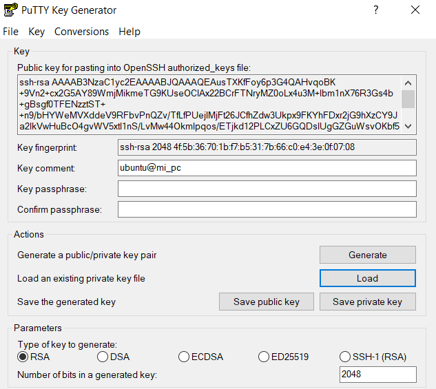
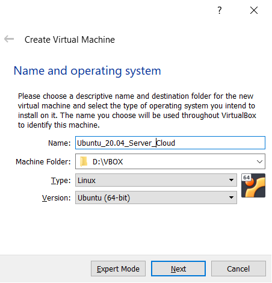
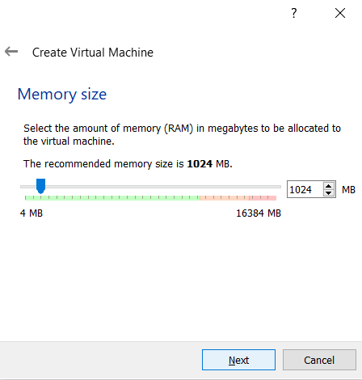
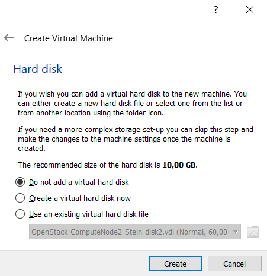
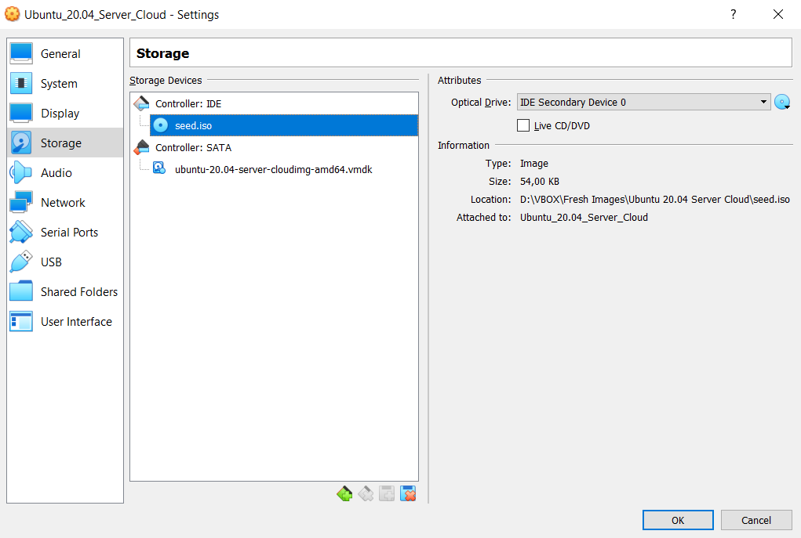
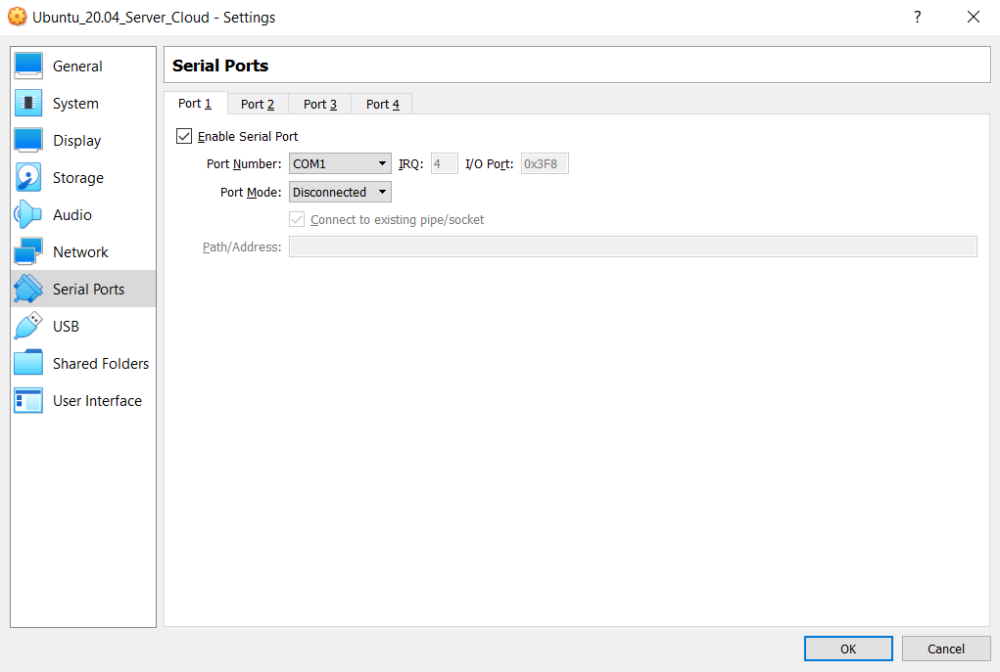
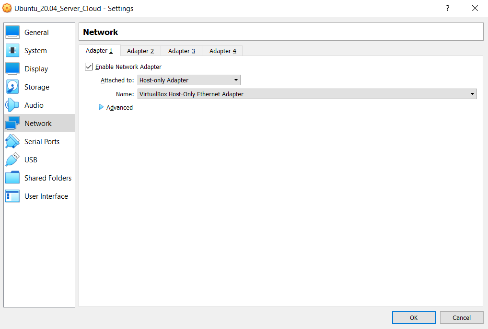
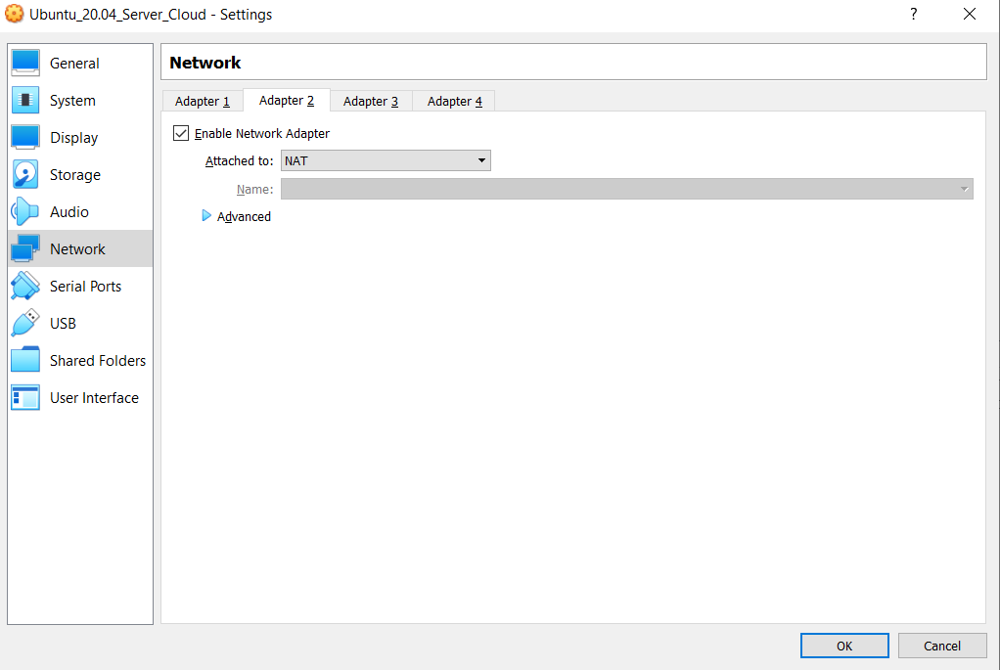
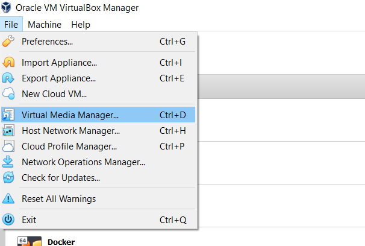
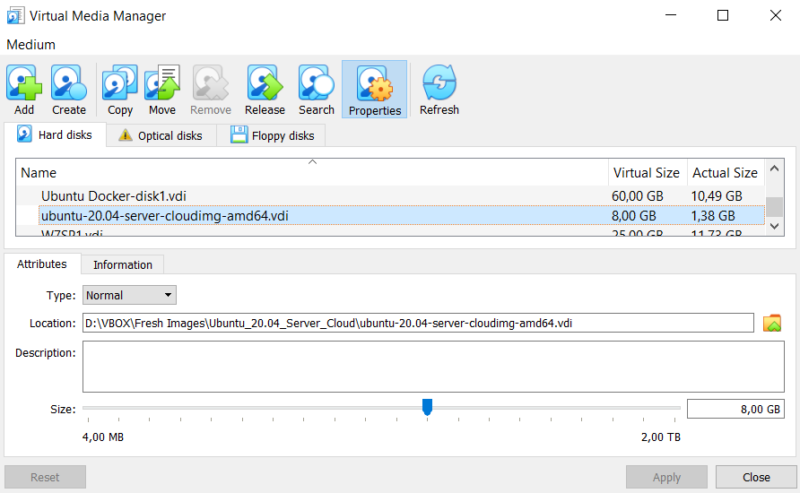

# Creation Ubuntu VM in VBox from Ubuntu cloud image

This repository contains the manual instructions and Windows' PowerShell automation script for generating a VM in VBox from Ubuntu Cloud Image


## Why

The goal is to automate the deployment of a headless Ubuntu server in VBox using a cloud-image ready to be configured in boot time using **cloud-init**.

Canonical generates cloud-specific images which are available on https://cloud-images.ubuntu.com/
Images for VMware/VBox in vmdk disk formats can be found there.
Those images can be configured through **cloud-init** at boot time, using [**NoCloud**](https://cloudinit.readthedocs.io/en/latest/topics/datasources/nocloud.html) data source.

Cloud-init metadata and user-data can be provided to a local VM boot via files in vfat or iso9660 filesystems. The filesystem volume label must be `cidata` or `CIDATA` and it must contain at least two files

    /user-data
    /meta-data

Network configuration can be provided to cloud-init formated in yaml file `network-config`

## PowerShell script for Windows

Required Software:
 - [Oracle VBox](https://www.virtualbox.org/)
 - [Qemu-img for Windows](https://cloudbase.it/qemu-img-windows/)
 - [CDBurnerXP](https://cdburnerxp.se/)
 - [PowerShell 7.0](https://github.com/PowerShell/PowerShell)


Create in windows a `SCRIPT` folder and place there script `create_vbox_vm_ubuntu_cloud.ps1`
Within SCRIPT directory create a `templates` directory and copy template files from the repository:
This folder contains the user-data and network-config templates used by the script.

From PowerShell console execute the script `create_vbox_vm_ubuntu_cloud.ps1`

Script execution
```
create_vbox_vm_ubuntu_cloud.ps1 -name <server_name>
                                -path <path>
                                -ip <server_ip>
                                -cores <cpu_cores>
                                -memory <server_memory_MB>
                                -disk_size <server_disk_size_MB>
                                -vbox_bridged_adapter <bridged_if>
                                -vbox_host_only_adapter <hostonly_if>

```

Parameters:
- **name**: (M) server name. VM server name and hostname. (M)
- **ip**: (M) must belong to VBox HostOnly network
- **path**: (O) Base path used for creating the VM directory (default value: '.' current directory). A directory with name **name** is created in **path** directory. If a server already exists within that directory, VM is not created. 
- **memory**: (O) VM memory in MB (default value 1024, 1GB)
- **cores**: (O) VM cpu cores (default value 1)
- **disk_size** (O) VM disk size in MB (default value 8192, 8GB)
- **vbox_bridged_adapter** (O) and **vbox_host_only_adapter** (O): VBOX interfaces names

VM is created with two interfaces:
  - NIC1 hostonly with static ip **ip*
  - NIC2 bridgeadapter with dynamic ip, dhcp

> NOTE: VBOX interfaces adapter names might need to be adapted to your own environment
> Commands for obtained VBOX configured interfaces
    vboxmanage list hostonlyifs
    vboxmanage list bridgedifs


The script will be use user-data and network-config templates located in `templates` directory named with `server_name` suffix:
- user-data-<name>.yml
- network-config-<name>.yml

If any of the files is missing the `default` files will be used.

Example execution:

```
create_vbox_vm_ubuntu_cloud.ps1 -name "server_name" -ip "192.168.56.201"
```


## Manual Instructions

### Step 1. Download Ubuntu 20.04 LTS 64 bits cloud-image in VMDK format

Download the specific image format from https://cloud-images.ubuntu.com/releases

> In our case, Ubuntu-20.04-server-cloudimg-amd64.vmdk
> 
> https://cloud-images.ubuntu.com/releases/focal/release/ubuntu-20.04-server-cloudimg-amd64.img

### Step 2. Convert img file to raw disk

Convert to raw format the img downloaded in step 2. Use `qemu-img` to conver it with the following command:

    qemu-img convert -O raw ubuntu-20.04-server-cloudimg-amd64.img ubuntu-20.04-server-cloudimg-amd64.raw

> NOTE: In windows qemu-img utility can be installed from [here](https://cloudbase.it/qemu-img-windows/)

### Step 3. Convert raw disk to VBox vdi disk

Convert the raw image to vdi format with VirtualBox tool `vboxmanage`
 
    vboxmanage convertfromraw ubuntu-20.04-server-cloudimg-amd64.raw ubuntu-20.04-server-cloudimg-amd64.vdi

> In windows the command should be something like this:
> 
>    "C:\Program Files\Oracle\VirtualBox\VBoxManage.exe" convertfromraw ubuntu-20.04-server-cloudimg-amd64.raw ubuntu-20.04-server-cloudimg-amd64.vdi


### Step 4: Clone the base vdi disk every time a new VM is created

Same vdi disk cannot be used for more than one VM (VDI's UUID must be unique within VBox instalation).
Clone Vdi disk procedure generated in step 3 every time a new VM need to be created

     vboxmanage clonehd ubuntu-20.04-server-cloudimg-amd64.vdi server1-ubuntu20.04.vdi

> In windows the command should be something like this:
> 
>    "C:\Program Files\Oracle\VirtualBox\VBoxManage.exe" clonehd ubuntu-20.04-server-cloudimg-amd64.vdi server1-ubuntu20.04.vdi


### Step 5. Create SSH keys

Authentication using SSH keys will be the only mechanism available to login to the server.
We will create SSH keys for two different users:

- **ricsanfre** user, used to connect from my home laptop

    For generating SSH private/public key in Windows, Putty Key Generator can be used:

    

Public-key string will be used in Step 6 to configure ssh_authorized_keys of the default user (ubuntu)

- **ansible** user, used to automate configuration activities with ansible
 
     For generating ansible SSH keys in Ubuntu server execute command:

        ssh-keygen

    In directory `$HOME/.ssh/` public and private key files can be found for the user

    `id_rsa` contains the private key and `id_rsa.pub` contains the public key.

    Content of the id_rsa.pub file has to be copied in Step 6 to configure ssh_authorized_keys of the ansible user
    ```
    cat id_rsa.pub 
    ssh-rsa AAAAB3NzaC1yc2EAAAADAQABAAABAQDsVSvxBitgaOiqeX4foCfhIe4yZj+OOaWP+wFuoUOBCZMWQ3cW188nSyXhXKfwYK50oo44O6UVEb2GZiU9bLOoy1fjfiGMOnmp3AUVG+e6Vh5aXOeLCEKKxV3I8LjMXr4ack6vtOqOVFBGFSN0ThaRTZwKpoxQ+pEzh+Q4cMJTXBHXYH0eP7WEuQlPIM/hmhGa4kIw/A92Rm0ZlF2H6L2QzxdLV/2LmnLAkt9C+6tH62hepcMCIQFPvHVUqj93hpmNm9MQI4hM7uK5qyH8wGi3nmPuX311km3hkd5O6XT5KNZq9Nk1HTC2GHqYzwha/cAka5pRUfZmWkJrEuV3sNAl ansible@pimaster
    ```

### Step 6. Create seed iso file

For creating the iso file from my windows labtop an open-source tool like [CDBurnerXP](https://cdburnerxp.se/)

- Create in a temporary directory `seed_iso`
- Create a file `meta-data`
  
     ```
     instance-id: ubuntucloud-001
     local-hostname: ubuntucloud1
     ```
- Create a file `user-data`

    ```yml
    #cloud-config
    # Set TimeZone and Locale
    timezone: Europe/Madrid
    locale: es_ES.UTF-8

    # Hostname
    hostname: servername
    # Ensure an entry in /etc/host is created
    manage_etc_hosts: localhost

    # Users. Remove default (ubuntu) + ansible user for remoto control
    users:
    - name: ricsanfre
        gecos: Ricardo Sanchez
        primary_group: users
        shell: /bin/bash
        sudo: ALL=(ALL) NOPASSWD:ALL
        lock_passwd: true
        ssh_authorized_keys:
        - ssh-rsa AAAAB3NzaC1yc2EAAAABJQAAAQEAusTXKfFoy6p3G4QAHvqoBK+9Vn2+cx2G5AY89WmjMikmeTG9KUseOCIAx22BCrFTNryMZ0oLx4u3M+Ibm1nX76R3Gs4b+gBsgf0TFENzztST++n9/bHYWeMVXddeV9RFbvPnQZv/TfLfPUejIMjFt26JCfhZdw3Ukpx9FKYhFDxr2jG9hXzCY9Ja2IkVwHuBcO4gvWV5xtI1nS/LvMw44Okmlpqos/ETjkd12PLCxZU6GQDslUgGZGuWsvOKbf51sR+cvBppEAG3ujIDySZkVhXqH1SSaGQbxF0pO6N5d4PWus0xsafy5z1AJdTeXZdBXPVvUSNVOUw8lbL+RTWI2Q== ubuntu@mi_pc
    - name: ansible
        gecos: Ansible user
        primary_group: users
        shell: /bin/bash
        sudo: ALL=(ALL) NOPASSWD:ALL
        lock_passwd: true
        ssh_authorized_keys:
        - ssh-rsa AAAAB3NzaC1yc2EAAAADAQABAAABAQDsVSvxBitgaOiqeX4foCfhIe4yZj+OOaWP+wFuoUOBCZMWQ3cW188nSyXhXKfwYK50oo44O6UVEb2GZiU9bLOoy1fjfiGMOnmp3AUVG+e6Vh5aXOeLCEKKxV3I8LjMXr4ack6vtOqOVFBGFSN0ThaRTZwKpoxQ+pEzh+Q4cMJTXBHXYH0eP7WEuQlPIM/hmhGa4kIw/A92Rm0ZlF2H6L2QzxdLV/2LmnLAkt9C+6tH62hepcMCIQFPvHVUqj93hpmNm9MQI4hM7uK5qyH8wGi3nmPuX311km3hkd5O6XT5KNZq9Nk1HTC2GHqYzwha/cAka5pRUfZmWkJrEuV3sNAl ansible@pimaster
    ```
- Create network-configuration file

    ```yml
    version: 2
    ethernets:
    enp0s3:
      dhcp4: no
      addresses: [192.168.56.100/24]
    enp0s8:
      dhcp4: yes
    ```

- Create ISO file with [CDBurnerXP](https://cdburnerxp.se/)
    
    Select the folder where the files has been generated and specify `CIDATA` as Volume Name

    In windows the command should be something like this:

        "C:\Program Files\CDBurnerXP\cdbxpcmd.exe" --burndata -folder:seed_iso -iso:seed.iso -format:iso -changefiledates -name:CIDATA

### Step 7. Create VM in VirtualBOX

- Create new VM without creating any virtual disk

    

    

    

- Copy vdi disk created in step 4 and seed.iso file created in step 6 to new VM's folder

- Configure new VM, add vmdiks and iso

   Add vmdk containing ubuntu image as new disk under SATA controller.

   Load seed.iso file in the Optical Disk (IDE Controller)

    

- Configure Serial Port
    Serial Port **Port1** need to be enabled.

    

- Configure network interfaces

    Two interfaces enabled: 
    
    Host-only interface

    

    NAT interface to provide internet access to the VM

    


### Step 8. Enlarge Disk size

The converterd vdi size is arround 2GB. It can be enlarged using VBOX GUI (form 6.0 release)

- Open Virtual Media Manager in VirtualBox
  
    

- Modify the size of the vdi created in step 4

    